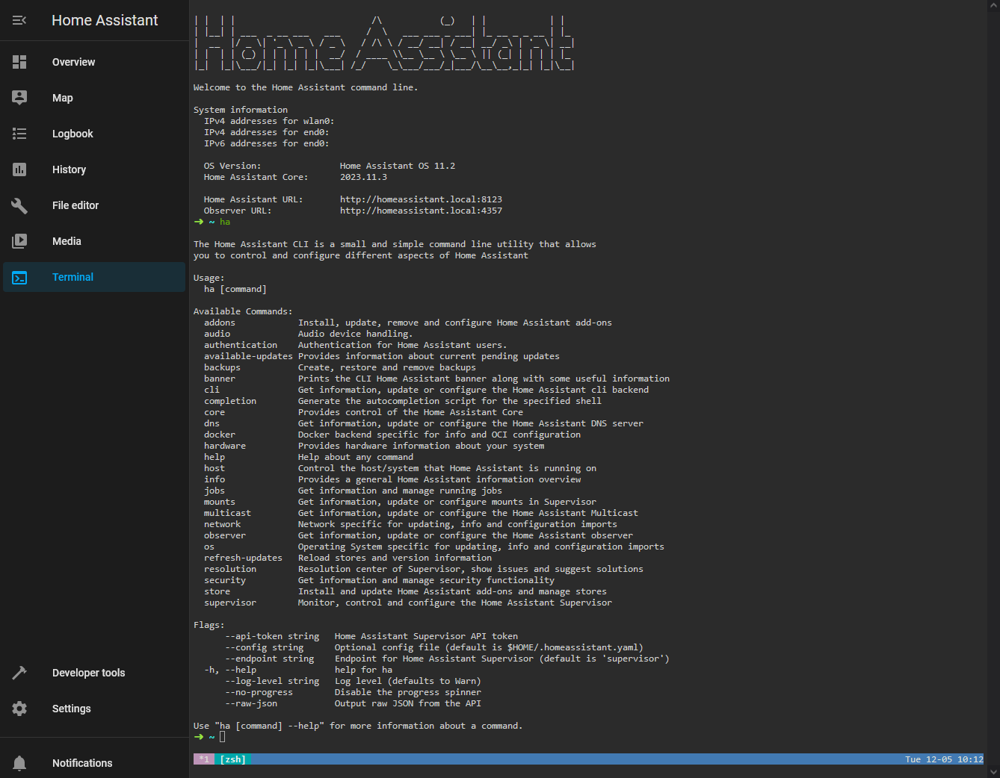
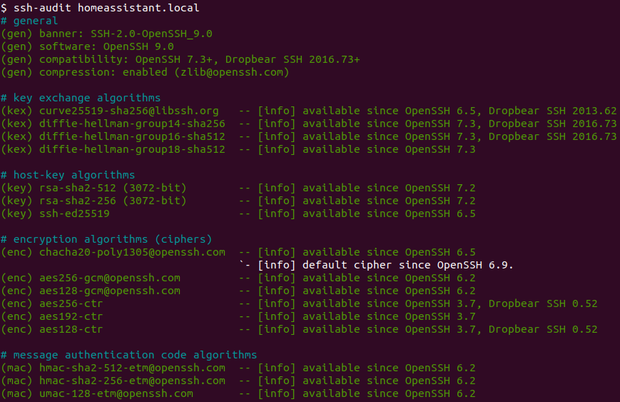

# Community Hass.io Add-ons: SSH & Web Terminal

[![GitHub Release][releases-shield]][releases]
![Project Stage][project-stage-shield]
[![License][license-shield]](LICENSE.md)

[![GitLab CI][gitlabci-shield]][gitlabci]
![Project Maintenance][maintenance-shield]
[![GitHub Activity][commits-shield]][commits]

[![Bountysource][bountysource-shield]][bountysource]
[![Discord][discord-shield]][discord]
[![Community Forum][forum-shield]][forum]

[![Buy me a coffee][buymeacoffee-shield]][buymeacoffee]

[![Support my work on Patreon][patreon-shield]][patreon]

This add-on allows you to log in to your Hass.io Home Assistant instance using
SSH or by using the Web Terminal.



## About

This add-on allows you to log in to your Hass.io Home Assistant instance using
SSH or a Web Terminal, giving you to access your Hass.io folders and
also includes a command-line tool to do things like restart, update,
and check your instance.

This is an enhanced version of the provided
[SSH add-on by Home Assistant][hass-ssh] and focusses on security,
usability, flexibility and also provides access using a web interface.

## WARNING

The SSH & Web Terminal add-on is a really powerful and gives you virtually
access to all tools and almost all hardware of your system.

While this add-on is created and maintained with care and with security in mind,
in the wrong or inexperienced hands, it could damage your system.

## Features

This add-on, of course, provides an SSH server, based on [OpenSSH][openssh] and
a web-based Terminal (which can be included in your Home Assistant frontend) as
well. Additionally, it comes out of the box with the following:

- Access your command line right from the Home Assistant frontend!
- A secure default configuration of SSH:
  - Only allows login by the configured user, even if more users are created.
  - Only uses known secure ciphers and algorithms.
  - Limits login attempts to hold of brute-force attacks better.
  - Many more security tweaks, *this addon passes all [ssh-audit] checks
    without warnings!*
    
- Passwords are checked with HaveIBeenPwned using K-anonymity.
- Comes with an SSH compatibility mode option to allow older clients to connect.
- Support for Mosh allowing roaming and supports intermittent connectivity.
- SFTP support is disabled by default but is user configurable.
- Compatible if Hass.io was installed via the generic Linux installer.
- Username is configurable, so `root` is no longer mandatory.
- Persists custom SSH client settings & keys between add-on restarts
- Log levels for allowing you to triage issues easier.
- Hardware access to your audio, uart/serial devices and GPIO pins.
- Runs with more privileges, allowing you to debug and test more situations.
- Has access to the dbus of the host system.
- Runs on host level network, allowing you to open ports or run little daemons.
- Have custom Alpine packages installed on start. This allows you to install
  your favorite tools, which will be available every single time you log in.
- Execute custom commands on add-on start so that you can customize the
  shell to your likings.
- [ZSH][zsh] as its default shell. Easier to use for the beginner, more advanced
  for the more experienced user. It even comes preloaded with
  ["Oh My ZSH"][ohmyzsh], with some plugins enabled as well.
- Contains a sensible set of tools right out of the box: curl, Wget, RSync, GIT,
  Nmap, Mosquitto client, MariaDB/MySQL client, Awake (“wake on LAN”), Nano,
  Vim, tmux, and a bunch commonly used networking tools.

## Installation

The installation of this add-on is pretty straightforward and not different in
comparison to installing any other Hass.io add-on.

1. If you installed the "SSH server" add-on from the built-in add-on, then
    remove that one first.
1. [Add our Hass.io add-ons repository][repository] to your Hass.io instance.
1. Install the "SSH & Web Terminal" add-on.
1. Configure the `username` and `password`/`authorized_keys` options.
1. Activate `ssl` on the Web Terminal if you use it.
1. Start the "SSH & Web Terminal" add-on.
1. Check the logs of the "SSH & Web Terminal" add-on to see if everything
    went well.

**NOTE**: Do not add this repository to Hass.io, please use:
`https://github.com/hassio-addons/repository`.

## Docker status

[![Docker Architecture][armhf-arch-shield]][armhf-dockerhub]
[![Docker Version][armhf-version-shield]][armhf-microbadger]
[![Docker Layers][armhf-layers-shield]][armhf-microbadger]
[![Docker Pulls][armhf-pulls-shield]][armhf-dockerhub]
[![Anchore Image Overview][armhf-anchore-shield]][armhf-anchore]

[![Docker Architecture][aarch64-arch-shield]][aarch64-dockerhub]
[![Docker Version][aarch64-version-shield]][aarch64-microbadger]
[![Docker Layers][aarch64-layers-shield]][aarch64-microbadger]
[![Docker Pulls][aarch64-pulls-shield]][aarch64-dockerhub]
[![Anchore Image Overview][aarch64-anchore-shield]][aarch64-anchore]

[![Docker Architecture][amd64-arch-shield]][amd64-dockerhub]
[![Docker Version][amd64-version-shield]][amd64-microbadger]
[![Docker Layers][amd64-layers-shield]][amd64-microbadger]
[![Docker Pulls][amd64-pulls-shield]][amd64-dockerhub]
[![Anchore Image Overview][amd64-anchore-shield]][amd64-anchore]

[![Docker Architecture][i386-arch-shield]][i386-dockerhub]
[![Docker Version][i386-version-shield]][i386-microbadger]
[![Docker Layers][i386-layers-shield]][i386-microbadger]
[![Docker Pulls][i386-pulls-shield]][i386-dockerhub]
[![Anchore Image Overview][i386-anchore-shield]][i386-anchore]

## Configuration

**Note**: _Remember to restart the add-on when the configuration is changed._

SSH add-on configuration:

```json
{
  "log_level": "info",
  "ssh": {
    "enable": true,
    "port": 22,
    "username": "hassio",
    "password": "",
    "authorized_keys": [
      "ssh-rsa AASDJKJKJFWJFAFLCNALCMLAK234234....."
    ],
    "sftp": false,
    "compatibility_mode": false,
    "allow_agent_forwarding": false,
    "allow_remote_port_forwarding": false,
    "allow_tcp_forwarding": false
  },
  "web": {
    "enable": true,
    "port": 7681,
    "username": "hassio",
    "password": "changeme",
    "ssl": true,
    "certfile": "fullchain.pem",
    "keyfile": "privkey.pem"
  },
  "share_sessions": true,
  "packages": [
    "python",
    "python-dev",
    "py-pip",
    "build-base"
  ],
  "init_commands": [
    "pip install virtualenv",
    "pip install yamllint"
  ]
}
```

**Note**: _This is just an example, don't copy and past it! Create your own!_

### Option: `log_level`

The `log_level` option controls the level of log output by the addon and can
be changed to be more or less verbose, which might be useful when you are
dealing with an unknown issue. Possible values are:

- `trace`: Show every detail, like all called internal functions.
- `debug`: Shows detailed debug information.
- `info`: Normal (usually) interesting events.
- `warning`: Exceptional occurrences that are not errors.
- `error`:  Runtime errors that do not require immediate action.
- `fatal`: Something went terribly wrong. Add-on becomes unusable.

Please note that each level automatically includes log messages from a
more severe level, e.g., `debug` also shows `info` messages. By default,
the `log_level` is set to `info`, which is the recommended setting unless
you are troubleshooting.

Using `trace` or `debug` log levels puts the SSH and Terminal daemons into
debug mode. While SSH is running in debug mode, it will be only able to
accept one single connection at the time.

### Option group `ssh`

---

The following options are for the option group: `ssh`. These settings
only apply to the SSH daemon.

#### Option `ssh`: `port`

The default port for SSH is `22`, some security guides recommend to
change the port to something else. Sometimes you'd just like to have it on
another port. Remember, if you change to port, be sure it is not in use
already!

#### Option `ssh`: `username`

This option allows you to change to username the use when you log in via SSH.
It is only utilized for the authentication; you will be the `root` user after
you have authenticated. Using `root` as the username is possible, but not
recommended.

**Note**: _Due to limitations, you will need to set this option to `root` in
order to be able to enable the SFTP capabilities._

**Note**: _This option support secrets, e.g., `!secret ssh_username`._

#### Option `ssh`: `password`

Sets the password to log in with. Leaving it empty would disable the possibility
to authenticate with a password. We would highly recommend not to use this
option from a security point of view.

**Note**: _The password will be checked against HaveIBeenPwned. If it is
listed, the add-on will not start._

**Note**: _This option support secrets, e.g., `!secret ssh_password`._

#### Option `ssh` `authorized_keys`

Add one or more public keys to your SSH server to use with authentication.
This is the recommended over setting a password.

Please take a look at the awesome [documentation created by GitHub][github-ssh]
about using public/private key pairs and how to create them.

#### Option `ssh`: `sftp`

When set to `true` the addon will enable SFTP support on the SSH daemon.
Please only enable it when you plan on using it.

**Note**: _Due to limitations, you will need to set the username to `root` in
order to be able to enable the SFTP capabilities._

#### Option `ssh`: `compatibility_mode`

This SSH add-on focusses on security and has therefore only enabled known
secure encryption methods. However, some older clients do not support these.
Setting this option to `true` will enable the original default set of methods,
allowing those clients to connect.

**Note**: _Enabling this option, lowers the security of your SSH server!_

#### Option `ssh`: `allow_agent_forwarding`

Specifies whether ssh-agent forwarding is permitted or not.

**Note**: _Enabling this option, lowers the security of your SSH server!
Nevertheless, this warning is debatable._

#### Option `ssh`: `allow_remote_port_forwarding`

Specifies whether remote hosts are allowed to connect to ports forwarded
for the client.

**Note**: _Enabling this affects all remote forwardings, so think carefully
before doing this._

#### Option `ssh`: `allow_tcp_forwarding`

Specifies whether TCP forwarding is permitted or not.

**Note**: _Enabling this option, lowers the security of your SSH server!
Nevertheless, this warning is debatable._

### Option group `web`

---

The following options are for the option group: `web`. These settings
only apply to the Web Terminal.

#### Option `web`: `username`

This option allows you to enable authentication on accessing the terminal.
It is only used for the authentication; you will be the `root` user after
you have authenticated. Using `root` as the username is possible, but not
recommended.

**Note**: _This option support secrets, e.g., `!secret terminal_username`._

#### Option `web`: `password`

Sets the password to authenticate with. If you set a `password`,
`username` becomes mandatory as well.

**Note**: _The password will be checked against HaveIBeenPwned. If it is
listed, the add-on will not start._

**Note**: _This option support secrets, e.g., `!secret terminal_password`._

#### Option `web`: `ssl`

Enables/Disables SSL (HTTPS) on the web terminal. Set it `true` to enable it,
`false` otherwise.

#### Option `web`: `certfile`

The certificate file to use for SSL.

**Note**: _The file MUST be stored in `/ssl/`, which is default for Hass.io_

#### Option `web`: `keyfile`

The private key file to use for SSL.

**Note**: _The file MUST be stored in `/ssl/`, which is default for Hass.io_

### Shared settings

---

The following options are shared between both the SSH and the Web Terminal.

#### Option: `packages`

Allows you to specify additional [Alpine packages][alpine-packages] to be
installed in your shell environment (e.g., Python, Joe, Irssi).

**Note**: _Adding many packages will result in a longer start-up
time for the add-on._

#### Option: `init_commands`

Customize your shell environment even more with the `init_commands` option.
Add one or more shell commands to the list, and they will be executed every
single time this add-on starts.

#### Option: `i_like_to_be_pwned`

Adding this option to the add-on configuration allows to you bypass the
HaveIBeenPwned password requirement by setting it to `true`.

**Note**: _We STRONGLY suggest picking a stronger/safer password instead of
using this option! USE AT YOUR OWN RISK!_

#### Option: `leave_front_door_open`

Adding this option to the add-on configuration allows you to disable
authentication on the Web Terminal by setting it to `true` and leaving the
username and password empty.

**Note**: _We STRONGLY suggest, not to use this, even if this add-on is
only exposed to your internal network. USE AT YOUR OWN RISK!_

## Embedding into Home Assistant

It is possible to embed the Web Terminal directly into Home Assistant, allowing
you to access your terminal through the Home Assistant frontend.

Home Assistant provides the `panel_iframe` component, for these purposes.

Example configuration:

```yaml
panel_iframe:
  terminal:
    title: Terminal
    icon: mdi:console
    url: https://addres.to.your.hass.io:7681
```

## Known issues and limitations

- The add-on fails to start when a password that is listed by HaveIBeenPwned
  is used. This is actually not a limitation, but a security feature.
- My browser throws an `ERR_SSL_PROTOCOL_ERROR`. The OPEN WEB UI button only
  works when SSL is enabled.
- When SFTP is enabled, the username MUST be set to `root`.
- The following error may occur in your add-on log, and can be safely ignored:

  ```txt
  ERR: lws_context_init_server_ssl: SSL_CTX_load_verify_locations unhappy
  ```

## Changelog & Releases

This repository keeps a change log using [GitHub's releases][releases]
functionality. The format of the log is based on
[Keep a Changelog][keepchangelog].

Releases are based on [Semantic Versioning][semver], and use the format
of ``MAJOR.MINOR.PATCH``. In a nutshell, the version will be incremented
based on the following:

- ``MAJOR``: Incompatible or major changes.
- ``MINOR``: Backwards-compatible new features and enhancements.
- ``PATCH``: Backwards-compatible bugfixes and package updates.

## Support

Got questions?

You have several options to get them answered:

- The [Community Hass.io Add-ons Discord chat server][discord] for add-on
  support and feature requests.
- The [Home Assistant Discord chat server][discord-ha] for general Home
  Assistant discussions and questions.
- The Home Assistant [Community Forum][forum].
- Join the [Reddit subreddit][reddit] in [/r/homeassistant][reddit]

You could also [open an issue here][issue] GitHub.

## Contributing

This is an active open-source project. We are always open to people who want to
use the code or contribute to it.

We have set up a separate document containing our
[contribution guidelines](CONTRIBUTING.md).

Thank you for being involved! :heart_eyes:

## Authors & contributors

The original setup of this repository is by [Franck Nijhof][frenck].

For a full list of all authors and contributors,
check [the contributor's page][contributors].

## We have got some Hass.io add-ons for you

Want some more functionality to your Hass.io Home Assistant instance?

We have created multiple add-ons for Hass.io. For a full list, check out
our [GitHub Repository][repository].

## License

MIT License

Copyright (c) 2017 Franck Nijhof

Permission is hereby granted, free of charge, to any person obtaining a copy
of this software and associated documentation files (the "Software"), to deal
in the Software without restriction, including without limitation the rights
to use, copy, modify, merge, publish, distribute, sublicense, and/or sell
copies of the Software, and to permit persons to whom the Software is
furnished to do so, subject to the following conditions:

The above copyright notice and this permission notice shall be included in all
copies or substantial portions of the Software.

THE SOFTWARE IS PROVIDED "AS IS", WITHOUT WARRANTY OF ANY KIND, EXPRESS OR
IMPLIED, INCLUDING BUT NOT LIMITED TO THE WARRANTIES OF MERCHANTABILITY,
FITNESS FOR A PARTICULAR PURPOSE AND NONINFRINGEMENT. IN NO EVENT SHALL THE
AUTHORS OR COPYRIGHT HOLDERS BE LIABLE FOR ANY CLAIM, DAMAGES OR OTHER
LIABILITY, WHETHER IN AN ACTION OF CONTRACT, TORT OR OTHERWISE, ARISING FROM,
OUT OF OR IN CONNECTION WITH THE SOFTWARE OR THE USE OR OTHER DEALINGS IN THE
SOFTWARE.

[aarch64-anchore-shield]: https://anchore.io/service/badges/image/55e8fa4b227a00fc208f4eeda7d19a1c81e09afc555f88d8c48ffc4ca621cc8c
[aarch64-anchore]: https://anchore.io/image/dockerhub/hassioaddons%2Fssh-aarch64%3Alatest
[aarch64-arch-shield]: https://img.shields.io/badge/architecture-aarch64-blue.svg
[aarch64-dockerhub]: https://hub.docker.com/r/hassioaddons/ssh-aarch64
[aarch64-layers-shield]: https://images.microbadger.com/badges/image/hassioaddons/ssh-aarch64.svg
[aarch64-microbadger]: https://microbadger.com/images/hassioaddons/ssh-aarch64
[aarch64-pulls-shield]: https://img.shields.io/docker/pulls/hassioaddons/ssh-aarch64.svg
[aarch64-version-shield]: https://images.microbadger.com/badges/version/hassioaddons/ssh-aarch64.svg
[alpine-packages]: https://pkgs.alpinelinux.org/packages
[amd64-anchore-shield]: https://anchore.io/service/badges/image/252449b021bd33788857d0cf74cb6449e062d150c52f132fa9c818ea025b544c
[amd64-anchore]: https://anchore.io/image/dockerhub/hassioaddons%2Fssh-amd64%3Alatest
[amd64-arch-shield]: https://img.shields.io/badge/architecture-amd64-blue.svg
[amd64-dockerhub]: https://hub.docker.com/r/hassioaddons/ssh-amd64
[amd64-layers-shield]: https://images.microbadger.com/badges/image/hassioaddons/ssh-amd64.svg
[amd64-microbadger]: https://microbadger.com/images/hassioaddons/ssh-amd64
[amd64-pulls-shield]: https://img.shields.io/docker/pulls/hassioaddons/ssh-amd64.svg
[amd64-version-shield]: https://images.microbadger.com/badges/version/hassioaddons/ssh-amd64.svg
[armhf-anchore-shield]: https://anchore.io/service/badges/image/e38b126bba8cf350fdabc57d3e27e3fd1f4135c5051dd6653d5eb63a72ba3d3b
[armhf-anchore]: https://anchore.io/image/dockerhub/hassioaddons%2Fssh-armhf%3Alatest
[armhf-arch-shield]: https://img.shields.io/badge/architecture-armhf-blue.svg
[armhf-dockerhub]: https://hub.docker.com/r/hassioaddons/ssh-armhf
[armhf-layers-shield]: https://images.microbadger.com/badges/image/hassioaddons/ssh-armhf.svg
[armhf-microbadger]: https://microbadger.com/images/hassioaddons/ssh-armhf
[armhf-pulls-shield]: https://img.shields.io/docker/pulls/hassioaddons/ssh-armhf.svg
[armhf-version-shield]: https://images.microbadger.com/badges/version/hassioaddons/ssh-armhf.svg
[bountysource-shield]: https://img.shields.io/bountysource/team/hassio-addons/activity.svg
[bountysource]: https://www.bountysource.com/teams/hassio-addons/issues
[buymeacoffee-shield]: https://www.buymeacoffee.com/assets/img/guidelines/download-assets-sm-2.svg
[buymeacoffee]: https://www.buymeacoffee.com/frenck
[commits-shield]: https://img.shields.io/github/commit-activity/y/hassio-addons/addon-ssh.svg
[commits]: https://github.com/hassio-addons/addon-ssh/commits/master
[contributors]: https://github.com/hassio-addons/addon-ssh/graphs/contributors
[discord-ha]: https://discord.gg/c5DvZ4e
[discord-shield]: https://img.shields.io/discord/478094546522079232.svg
[discord]: https://discord.me/hassioaddons
[forum-shield]: https://img.shields.io/badge/community-forum-brightgreen.svg
[forum]: https://community.home-assistant.io/t/community-hass-io-add-on-ssh-web-terminal/33820?u=frenck
[frenck]: https://github.com/frenck
[github-ssh]: https://help.github.com/articles/connecting-to-github-with-ssh/
[gitlabci-shield]: https://gitlab.com/hassio-addons/addon-ssh/badges/master/pipeline.svg
[gitlabci]: https://gitlab.com/hassio-addons/addon-ssh/pipelines
[hass-ssh]: https://home-assistant.io/addons/ssh/
[home-assistant]: https://home-assistant.io
[i386-anchore-shield]: https://anchore.io/service/badges/image/64134edf5a306e59e896c127742201c8e7bfccc2e10a622819a569f30e8e56c5
[i386-anchore]: https://anchore.io/image/dockerhub/hassioaddons%2Fssh-i386%3Alatest
[i386-arch-shield]: https://img.shields.io/badge/architecture-i386-blue.svg
[i386-dockerhub]: https://hub.docker.com/r/hassioaddons/ssh-i386
[i386-layers-shield]: https://images.microbadger.com/badges/image/hassioaddons/ssh-i386.svg
[i386-microbadger]: https://microbadger.com/images/hassioaddons/ssh-i386
[i386-pulls-shield]: https://img.shields.io/docker/pulls/hassioaddons/ssh-i386.svg
[i386-version-shield]: https://images.microbadger.com/badges/version/hassioaddons/ssh-i386.svg
[issue]: https://github.com/hassio-addons/addon-ssh/issues
[keepchangelog]: http://keepachangelog.com/en/1.0.0/
[license-shield]: https://img.shields.io/github/license/hassio-addons/addon-ssh.svg
[maintenance-shield]: https://img.shields.io/maintenance/yes/2018.svg
[ohmyzsh]: http://ohmyz.sh/
[openssh]: https://www.openssh.com/
[patreon-shield]: https://www.frenck.nl/images/patreon.png
[patreon]: https://www.patreon.com/frenck
[project-stage-shield]: https://img.shields.io/badge/project%20stage-production%20ready-brightgreen.svg
[reddit]: https://reddit.com/r/homeassistant
[releases-shield]: https://img.shields.io/github/release/hassio-addons/addon-ssh.svg
[releases]: https://github.com/hassio-addons/addon-ssh/releases
[repository]: https://github.com/hassio-addons/repository
[semver]: http://semver.org/spec/v2.0.0.htm
[ssh-audit]: https://github.com/arthepsy/ssh-audit
[zsh]: https://en.wikipedia.org/wiki/Z_shell
